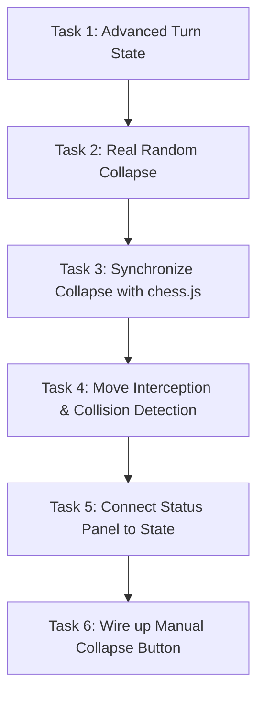

# Schrödinger's Gambit — Project Handoff Document

This document provides a comprehensive overview of **Schrödinger's Gambit**, a quantum-inspired chess variant web application. It outlines the project's goal, architecture, current implementation status, design system, coding conventions, known bugs, and the roadmap for the next development agent to ensure a seamless continuation.

---

# Project Overview

- **Project Name**: Schrödinger's Gambit
- **Description**: Schrödinger's Gambit is a premium web implementation of a chess variant inspired by quantum mechanics. The core gameplay allows players to put pieces into a state of superposition (splitting a single piece into two separate potential squares on the board). The board visually renders the piece in both locations as semi-transparent "ghosts" and hides the piece from its original square. This superposition remains active until a measurement event (such as a capture attempt or another piece trying to move onto or through a superposition square) forces a state collapse, resolving the piece's position to one of the two squares with a 50/50 probability.
- **Primary Goal**: To create a fully playable, local two-player quantum chess game featuring complete quantum move validation, real-time board collapse handling, an interactive probability telemetry display, a live-updated operational logging terminal, and interactive guides on the physics principles involved.
- **Current Development Stage**: **Stage 2: Interface & Scaffolding**. The landing page, game page layout, board coordinates, piece SVGs, and visual superposition targeting (selecting a piece, initiating superposition, and picking two target squares) are fully implemented. The standard chess mechanics are managed by a wrapped `chess.js` instance. The quantum overlay mechanics are visually merged for rendering, but the underlying turn synchronization, move interception, collision detection, and collapse synchronization are mocked or scaffolded.
- **Intended End Result**: A high-fidelity, polished, and fully functional local web application where players can play a complete game of Schrödinger's Gambit, experience state collapses, view real-time wave function statistics, and read chess logs.
- **Target Users**: Chess enthusiasts looking for complex tactical variants, science and physics educators/students seeking interactive representations of superposition and measurement, and casual gamers attracted to futuristic, high-concept strategy games.

---

# Tech Stack

- **Core Languages**: TypeScript (~6.0.2), HTML5, CSS3
- **UI Library**: React (v19.2.7), React DOM (v19.2.7)
- **Routing**: React Router DOM (v7.18.1)
- **Build Tool & Dev Server**: Vite (v8.1.1) with `@vitejs/plugin-react` (v6.0.3)
- **CSS Framework**: Tailwind CSS (v4.3.2) with `@tailwindcss/vite` (v4.3.2)
- **Animations**: Framer Motion (v12.42.2) and native CSS `@keyframes`
- **Chess Engine**: `chess.js` (v1.4.0) for standard chess movement validation and game-over state checks (check, checkmate, stalemate, draws)
- **Linter**: Oxlint (v1.71.0)
- **Package Manager**: npm (utilizing `package-lock.json` lockfile v3)

---

# Folder & Architecture Overview

### Folder Structure

```
schrodingers-gambit/
├── .git/
├── .gitignore
├── .oxlintrc.json
├── index.html
├── package.json
├── package-lock.json
├── tsconfig.json
├── tsconfig.app.json
├── tsconfig.node.json
├── vite.config.ts
├── dist/                  # Production build output
├── public/                # Static assets
└── src/
    ├── App.tsx            # Routes definition (Landing, Play)
    ├── main.tsx           # React entry point
    ├── index.css          # Design system, CSS variables, custom animations
    ├── components/        # Reusable global layout & UI primitives
    │   ├── layout/
    │   │   └── Header.tsx
    │   └── landing/
    │       ├── BackgroundGrid.tsx
    │       ├── CTAButton.tsx
    │       └── Hero.tsx
    ├── pages/             # Page containers
    │   ├── landing/
    │   │   └── LandingPage.tsx
    │   └── game/
    │       └── GamePage.tsx
    ├── features/          # Domain-driven features
    │   ├── chess/         # Classical Chess visual components & types
    │   │   ├── components/
    │   │   │   ├── BoardCoordinates.tsx
    │   │   │   ├── ChessBoard.tsx
    │   │   │   ├── Piece.tsx
    │   │   │   ├── Square.tsx
    │   │   │   ├── QuantumStatusPanel.tsx
    │   │   │   └── OperationalLogPanel.tsx
    │   │   └── types/
    │   │       └── index.ts
    │   ├── engine/        # Classical Chess simulation layer
    │   │   ├── boardMapper.ts
    │   │   ├── chessEngine.ts
    │   │   └── moveValidation.ts
    │   ├── hooks/         # React State Orchestration
    │   │   └── useChessGame.ts
    │   └── quantum/       # Quantum Mechanics layer
    │       ├── engine/
    │       │   └── quantumEngine.ts
    │       ├── types/
    │       │   └── quantum.ts
    │       └── utils/
    │           └── quantumUtils.ts
    ├── lib/
    ├── styles/
    └── types/
```

### Architecture

The application is structured around a **Decoupled Model-View-Orchestrator** pattern:

1. **Model Layer**:
   - `ChessEngine` wraps `chess.js` and maintains the deterministic board state, FEN, turn, check status, and game history. It is completely unaware of quantum mechanics.
   - `QuantumEngine` maintains the quantum state (`QuantumState`), which tracks the active `QuantumOverlay`, whether each color has spent their single quantum move, and the measurement history. It is completely unaware of classical chess rules beyond coordinate systems.
2. **Orchestrator Layer (`useChessGame` hook)**:
   - Synchronizes the state of the two engines.
   - Integrates user interactions (clicks, keyboard presses) and drives state transitions.
   - Merges the board states from both engines into a single visual representation via `getMergedBoardState`.
3. **View Layer (React Components)**:
   - Displays the merged representation of the board.
   - Visualizes overlays (dashed lines, transparent pieces, selection grids) depending on the active mode (classical vs. quantum).
   - Feeds interaction coordinates back to the orchestrator.

### Routing

Handled client-side via `react-router-dom`:
- `/` -> `LandingPage`: The atmospheric hero page welcoming users.
- `/play` -> `GamePage`: The central game screen housing the board and dashboards.

### State Management

- Controlled entirely via React state inside `useChessGame.ts`.
- The instances of `ChessEngine` and `QuantumEngine` are instantiated and cached using React's `useMemo` hook so their state persists across re-renders:
  ```typescript
  const engine = useMemo(() => new ChessEngine(), [])
  const quantumEngine = useMemo(() => new QuantumEngine(), [])
  ```
- Exposes derived state properties (e.g. `board`, `turn`, `isGameOver`, `kingInCheckSquare`, `history`) to React state to trigger UI updates.

### Styling Approach

- Native CSS variables in `src/index.css` drive the colors, fonts, and scrollbars.
- Tailwind CSS v4 directives consume these variables to extend utility rules.
- Glassmorphism, radial glows, and dashed grid viewfinders are styled using a blend of Tailwind utility classes and raw inline CSS styling (for custom gradient positions).

### Authentication & Database

- None. The application runs entirely on the client.

---

# Design System

The application utilizes a dark, high-contrast, scientific UI theme designed to resemble a laboratory instrumentation console.

### Typography

- **Heading Font**: `"Helvetica Neue", "Helvetica", "Arial", sans-serif` (thin weights, uppercase, tracked/letter-spaced)
- **Body Font**: `"Inter", "system-ui", "-apple-system", sans-serif`
- **Monospace Font**: `"JetBrains Mono", "Fira Code", "Consolas", monospace` (used for scientific readings, status lines, action buttons, and logging)
- **Serif Font**: `"Georgia", serif` and `"Lora", serif` (used for quotes and the main branding title)

### Colors

Defined in `src/index.css`:

| Variable Name | HSL / Hex Code | Tailwind Equivalent | Purpose |
| :--- | :--- | :--- | :--- |
| `--bg-primary` | `#0a0a0b` | `bg-bg-primary` | Main page background |
| `--surface` | `#161618` | `bg-surface` | Default container panels |
| `--surface-elevated` | `#1e1e21` | `bg-surface-elevated` | Modal dialogs and hover states |
| `--text-primary` | `#f0f0f2` | `text-text-primary` | Primary text and light chess pieces |
| `--text-secondary` | `#8a8a8e` | `text-text-secondary` | Subtitle text and dark chess piece accents |
| `--sage` | `#97A88A` | `text-sage` / `border-sage` | Quantum branding, overlays, and selection states |
| `--accent` | `#4a9e9e` | `text-accent` | System indicators (Check, telemetry charts) |
| `--accent-glow` | `rgba(74, 158, 158, 0.15)` | — | Radial glow behind the hero page |
| `--border` | `#2a2a2e` | `border-border` | Subtle panel separators and background grids |
| `--success` | `#4a9e6a` | `bg-success` / `text-success` | Stable LED state indicators |

### Border Radius

- **`0px` (Strictly Rectangular)**: All buttons, panels, inputs, and coordinates use flat, unrounded borders to emphasize a clinical, industrial feel.

### Shadows & Glows

- Custom radial gradient overlay on landing:
  ```css
  background: radial-gradient(ellipse 600px 400px at 50% 45%, var(--accent-glow), transparent);
  ```
- Large, dark dropshadows on the main chessboard to float it over the background grid.

### Animations & Motion

- **Fade-in / Blur Transitions**: Page changes fade smoothly over 600ms.
- **Quantum Transitions**: Custom keyframes define the fade-in of superposition splits and the fade-out of the collapsed source square:
  ```css
  @keyframes quantum-fade-in {
    from { opacity: 0; filter: blur(4px); }
    to { opacity: 0.5; filter: blur(1px); }
  }
  @keyframes quantum-fade-out {
    from { opacity: 1; filter: blur(0px); }
    to { opacity: 0; filter: blur(4px); }
  }
  ```
- **Scale Interaction**: Buttons use Framer Motion for tap-down physics (`scale: 0.98`) and hover expansions (`scale: 1.02`).

### Responsiveness

- Supported via responsive layout columns:
  - Mobile: Panels stack vertically.
  - Desktop (`lg` breakpoint): A 4-column grid (1 col Quantum Status, 2 cols Board, 1 col Move Logs).

### Accessibility

- Interactive chessboard buttons (`Square.tsx`) are keyboard focusable and utilize screen-reader descriptions:
  ```typescript
  const ariaLabel = `${coordinate}, ${piece ? `${piece.color} ${piece.type}` : 'empty'}`;
  ```
- Supports custom focus outline rings (`focus-visible:outline-sage`).
- ESC keyboard listener clears active selections and cancels active quantum targeting.

---

# Features Checklist

- [x] **High-Fidelity Scientific Landing Page**: Header, Hero block, background coordinate grids, Greek letters, and CTA buttons.
- [x] **Classical Chess Move Mechanics**: Select piece, view legal moves, execute move, highlights for last move and active check state.
- [x] **Interactive Promotion Modal**: Triggers pawn-promotion choices (Queen, Rook, Bishop, Knight) on rank 8/1.
- [x] **Game Over Overlays**: Intercepts checkmate and draw states, showing customized messages based on draw reason.
- [x] **Superposition (Split Move) Targeting Flow**: Clicking "Initiate Superposition" lets players choose two legal squares to split a piece.
- [x] **Render-Layer Quantum Merging**: Hides original piece, renders two transparent "ghost" copies with a tiny "Ψ" label in the corners.
- [x] **SVG Connector Line**: Drawing a dashed line between the two superposition squares when hovering over either of them.
- [ ] **Quantum Turn Synchronization**: Allow turns to advance correctly inside the game loop when a superposition is committed.
- [ ] **State Collapse Engine**: Randomly collapses active superpositions to square A or B (50/50) upon measurement triggers.
- [ ] **Movement Collision Interception**: Detects when a classical piece moves into/through a quantum cell and triggers collapse.
- [ ] **Active Wave Function Telemetry**: Connects the `QuantumStatusPanel` to live state data rather than static mocks.
- [ ] **Log Console Integration**: Records quantum splits and collapses in the operational move registry.
- [ ] **Manual Collapse Button**: Clicking "Collapse State" triggers a manual measurement on the active overlay.

---

# Components

### 1. `ChessBoard` ([ChessBoard.tsx](file:///c:/Users/aarag/Desktop/schrodingers-gambit/src/features/chess/components/ChessBoard.tsx))
- **Responsibility**: Houses the 8x8 cell grid, draws coordinates, renders the quantum coupling SVG line, and overlays the promotion and game-over dialogs.
- **Props**:
  ```typescript
  interface ChessBoardProps {
    board: BoardState
    selectedSquare: string | null
    legalMoves: string[]
    lastMove: { from: string; to: string } | null
    kingInCheckSquare: string | null
    promotionPending: { from: string; to: string } | null
    isGameOver: boolean
    isCheckmate: boolean
    drawReason: 'threefold' | 'material' | 'fifty-moves' | 'stalemate' | 'unknown' | null
    turn: 'w' | 'b'
    onSquareClick: (square: string) => void
    onPromoteSelect: (piece: 'q' | 'r' | 'b' | 'n') => void
    onPromoteCancel: () => void
    onResetGame: () => void
    onReturnHome: () => void
    firstTarget?: string | null
    secondTarget?: string | null
    currentOverlay?: QuantumOverlay | null
  }
  ```
- **Logic**: Tracks the currently hovered square via React state. When the hovered square is a branch of an active superposition, it calculates the midpoint coordinates of both squares in percentage offsets to render a direct vector coupling line:
  ```typescript
  const x1 = `${(idxA.col + 0.5) * 12.5}%`;
  const y1 = `${(idxA.row + 0.5) * 12.5}%`;
  ```
- **Connected Components**: `Square`, `BoardCoordinates`.

### 2. `Square` ([Square.tsx](file:///c:/Users/aarag/Desktop/schrodingers-gambit/src/features/chess/components/Square.tsx))
- **Responsibility**: Individual grid cell. Manages selection outlines, checking indicators, last-move highlights, ghost opacities, and mouse callbacks.
- **Props**: Includes cell metadata, coordinates, click callbacks, hover hooks, and flags specifying whether it is a branch of the active superposition.
- **Logic**: Applies different styling layers based on boolean flags:
  - If a piece is quantum, it sets `opacity-50 blur-[0.5px]` and displays a corner `Ψ` marker.
  - If the original piece is in the process of splitting, it displays a copy with `animate-quantum-fade-out`.
- **Connected Components**: `Piece`.

### 3. `Piece` ([Piece.tsx](file:///c:/Users/aarag/Desktop/schrodingers-gambit/src/features/chess/components/Piece.tsx))
- **Responsibility**: Outputs inline SVG vector shapes representing the 6 chess piece types.
- **Props**: `type` ('p' | 'r' | 'n' | 'b' | 'q' | 'k'), `color` ('w' | 'b'), optional `className`.
- **Logic**: Dynamically changes SVG fill and stroke colors based on color props:
  ```typescript
  const strokeColor = isWhite ? '#161618' : '#f0f0f2'
  const fillColor = isWhite ? '#f0f0f2' : '#222225'
  ```

### 4. `QuantumStatusPanel` ([QuantumStatusPanel.tsx](file:///c:/Users/aarag/Desktop/schrodingers-gambit/src/features/chess/components/QuantumStatusPanel.tsx))
- **Responsibility**: Telemetry readout of the wave field.
- **Props**: None (static mockup).
- **Logic**: Renders grid outlines, a waving SVG distribution curve representing probability density, and static statistics.
- **Future Improvements**: Needs to accept the actual `QuantumOverlay` and `measurementHistory` to dynamically show the number of active states, collapse odds, and live wave behaviors.

### 5. `OperationalLogPanel` ([OperationalLogPanel.tsx](file:///c:/Users/aarag/Desktop/schrodingers-gambit/src/features/chess/components/OperationalLogPanel.tsx))
- **Responsibility**: Moves log and primary controls.
- **Props**: `history` (SAN move strings), `onResetGame`, `onAbortTest`, `onClearSelection`.
- **Logic**: Organizes flat histories into paired rounds and renders them in a monospace column.
- **Future Improvements**: Connect "Collapse State" to trigger a collapse, and support rendering quantum actions in the logs.

---

# Current Progress

### What Has Been Completed
1. Full styling framework and design tokens configured via Tailwind CSS v4.
2. Complete responsive page navigation and layout systems (Landing and Play screens).
3. Solid integration of classical chess validation rules via the `chess.js` engine wrapper.
4. Interactive board layout, custom simplified piece vector designs, coordinates, check indicators, promotion dialogs, and game-over states.
5. High-fidelity visual split-targeting flow where pieces fade out of their source coordinate and fade into two transparent superposition squares, with dynamic dashed lines coupling them together on hover.

### What Was Being Worked On Most Recently
Refining the visual telemetry bars, highlights, and selection-cancelling logic in `useChessGame.ts` to ensure that clicking around the board behaves correctly when superposition targeting is active.

### What Should Be Built Next & Why
The next priority is the **Quantum Turn Synchronization & Collapse Engine**. Currently, committing a superposition registers the overlay visually but does not notify the classical engine. As a result, the active turn does not progress, locking the game. Building the state collapse logic and turn advancement is essential to make the game playable.

---

# Decisions Made (with Rationale)

1. **`chess.js` Integration**:
   - *Decision*: Wrap standard `chess.js` for chess validation rather than writing a custom rule engine.
   - *Rationale*: Classical chess movement (especially en passant, castling, and checking vectors) is incredibly complex. Writing a custom validator introduces significant risk. Wrapping `chess.js` guarantees rule compliance.
2. **Visual-Only Superposition State**:
   - *Decision*: Maintain the splitting piece at its original square in `chess.js` during active superposition, and perform the rendering adjustments entirely in the presentation layer.
   - *Rationale*: Standard `chess.js` throws exceptions if a piece is placed on two squares. By keeping it at its original square under the hood, we keep the engine valid. Once a collapse triggers, we can perform a standard classical move to the resolved square.
3. **One Active Superposition Limit**:
   - *Decision*: Allow only one piece to be in superposition at a time.
   - *Rationale*: Allowing multiple superpositions introduces nested, cascading entanglements (e.g. piece A is split, and piece B splits onto one of piece A's squares). Modeling this requires a complex graph of dependent states. A single superposition keeps the scope manageable and the UI clean.
4. **Muted Laboratory Style (Zero Radius corners)**:
   - *Decision*: Strictly avoid rounded panels or soft pill buttons.
   - *Rationale*: Rounded styling looks like a generic mobile app. Clean, sharp lines, monospace readings, and scientific formulas evoke the feel of a high-tech laboratory spectrometer.

---

# Coding Conventions

- **File Naming**: PascalCase for components (e.g. `ChessBoard.tsx`), camelCase for hooks and utilities (e.g. `useChessGame.ts`, `boardMapper.ts`).
- **Imports**: Group third-party imports at the top, followed by absolute/relative project files:
  ```typescript
  import React, { useState } from 'react'
  import { motion } from 'framer-motion'
  import type { BoardState } from '../types'
  ```
- **Type Guarding**: Avoid using non-null assertions (`!`). Use explicit runtime checks:
  ```typescript
  if (!selectedSquare || !firstTarget) return;
  ```
- **Styling**: Favor standard Tailwind utility classes inside components. Put custom keyframe animations and structural layouts inside `src/index.css`.
- **Method Documentation**: Place clean JSDoc headers on class helper methods and hooks explaining their role in the quantum simulation.

---

# Known Bugs & Technical Debt

1. **Turn Progression Lock**: Committing a split move registers the overlay but doesn't advance the turn in `chess.js`, so the game cannot progress to the next player's turn.
2. **Mock Collapse Resolution**: `QuantumEngine.triggerCollapse` is hardcoded to return `squareA`. It needs a random selection (50/50) between `squareA` and `squareB`.
3. **Mock Telemetry Data**: The statistics on the `QuantumStatusPanel` (coherence, probability, etc.) are static.
4. **Lack of Move Interception**: Classic pieces can currently move through or land on squares occupied by quantum ghost pieces without triggering a collapse.
5. **No Checkmate Verification for Superpositions**: The checkmate engine does not account for a King or checking piece that is in superposition, which can lead to false checkmate reports.

---

# Important Context

- **The Classical State Paradox**: Because the classical chess engine still holds the piece at `fromSquare` during superposition, `chess.js` believes that the original square is occupied and the destination squares are empty. This means:
  - The opponent cannot land on the original square (even though it looks empty).
  - The opponent can freely move through the destination squares (even though a quantum piece might be there).
  To resolve this, the orchestrator hook must intercept clicks and check if a move impacts a quantum square *before* letting the move pass to `chess.js`. If a conflict occurs, a collapse must be triggered first.

---

# Dependencies Between Tasks



---

# Next 10 Tasks (Roadmap)

### Task 1: Advancing the Turn State on Split Move
- **Objective**: Ensure that committing a superposition advances the turn to the opposite color.
- **Files to Modify**: [useChessGame.ts](file:///c:/Users/aarag/Desktop/schrodingers-gambit/src/features/hooks/useChessGame.ts)
- **Estimated Complexity**: Low
- **Prerequisites**: None
- **Expected Outcome**: When a split move is completed, the turn indicators update and the other player is permitted to make their move.

### Task 2: Implement Real Random Collapse Probability
- **Objective**: Update the collapse trigger to select between target A and B with a 50% probability.
- **Files to Modify**: [quantumEngine.ts](file:///c:/Users/aarag/Desktop/schrodingers-gambit/src/features/quantum/engine/quantumEngine.ts)
- **Estimated Complexity**: Low
- **Prerequisites**: Task 1
- **Expected Outcome**: `triggerCollapse` returns either `squareA` or `squareB` randomly.

### Task 3: Synchronize Collapsed Outcomes with the Classical Engine
- **Objective**: When a superposition collapses, execute the move in `chess.js` to place the piece at the collapsed square.
- **Files to Modify**: [useChessGame.ts](file:///c:/Users/aarag/Desktop/schrodingers-gambit/src/features/hooks/useChessGame.ts), [chessEngine.ts](file:///c:/Users/aarag/Desktop/schrodingers-gambit/src/features/engine/chessEngine.ts)
- **Estimated Complexity**: Medium
- **Prerequisites**: Task 2
- **Expected Outcome**: The classical board in `chess.js` updates to reflect the piece's collapsed location, preserving engine integrity.

### Task 4: Implement Move Interception & Collision Detection
- **Objective**: Automatically trigger a collapse when a player attempts to move onto or through a superposition square.
- **Files to Modify**: [useChessGame.ts](file:///c:/Users/aarag/Desktop/schrodingers-gambit/src/features/hooks/useChessGame.ts)
- **Estimated Complexity**: High
- **Prerequisites**: Task 3
- **Expected Outcome**: Clicks on superposition squares intercept the standard classical move path, resolve the quantum state first, and then apply the classical action depending on the collapse outcome.

### Task 5: Connect Quantum Status Telemetry Panel to Live State
- **Objective**: Display real metrics (number of active overlays, historical collapses) on the wave function panel.
- **Files to Modify**: [QuantumStatusPanel.tsx](file:///c:/Users/aarag/Desktop/schrodingers-gambit/src/features/chess/components/QuantumStatusPanel.tsx)
- **Estimated Complexity**: Low
- **Prerequisites**: Task 3
- **Expected Outcome**: Pulled statistics reflect real game data instead of static placeholders.

### Task 6: Hook Up Manual Collapse Button
- **Objective**: Wire the "Collapse State" button to manually resolve the active superposition.
- **Files to Modify**: [useChessGame.ts](file:///c:/Users/aarag/Desktop/schrodingers-gambit/src/features/hooks/useChessGame.ts), [OperationalLogPanel.tsx](file:///c:/Users/aarag/Desktop/schrodingers-gambit/src/features/chess/components/OperationalLogPanel.tsx)
- **Estimated Complexity**: Low
- **Prerequisites**: Task 3
- **Expected Outcome**: Clicking the manual button triggers collapse and updates the board immediately.

### Task 7: Integrate Quantum Move Notation in Logs
- **Objective**: Add notation for split moves (e.g. `Ne2/c3,d4`) and collapses (e.g. `N@d4`) to the move registry.
- **Files to Modify**: [useChessGame.ts](file:///c:/Users/aarag/Desktop/schrodingers-gambit/src/features/hooks/useChessGame.ts), [OperationalLogPanel.tsx](file:///c:/Users/aarag/Desktop/schrodingers-gambit/src/features/chess/components/OperationalLogPanel.tsx)
- **Estimated Complexity**: Medium
- **Prerequisites**: Task 4
- **Expected Outcome**: Monospace logs show precise quantum symbols alongside standard classical steps.

### Task 8: Restrict Superposition Destination Moves
- **Objective**: Ensure that split targets are valid classical moves for the selected piece.
- **Files to Modify**: [useChessGame.ts](file:///c:/Users/aarag/Desktop/schrodingers-gambit/src/features/hooks/useChessGame.ts)
- **Estimated Complexity**: Low
- **Prerequisites**: None
- **Expected Outcome**: The user can only split pieces onto squares that are highlighted as legal destinations.

### Task 9: Resolve Quantum Checkmate Scenarios
- **Objective**: Adjust checking detection to handle situations where the King or checking piece is in superposition.
- **Files to Modify**: [moveValidation.ts](file:///c:/Users/aarag/Desktop/schrodingers-gambit/src/features/engine/moveValidation.ts), [useChessGame.ts](file:///c:/Users/aarag/Desktop/schrodingers-gambit/src/features/hooks/useChessGame.ts)
- **Estimated Complexity**: High
- **Prerequisites**: Task 4
- **Expected Outcome**: The game does not incorrectly end in checkmate if the check can be resolved by a quantum collapse.

### Task 10: Local Game History Persistence
- **Objective**: Save the current game state to local storage to allow state recovery on page refresh.
- **Files to Modify**: [useChessGame.ts](file:///c:/Users/aarag/Desktop/schrodingers-gambit/src/features/hooks/useChessGame.ts)
- **Estimated Complexity**: Medium
- **Prerequisites**: Task 4
- **Expected Outcome**: Refreshing the page reloads the board, active overlays, logs, and spent quantum moves.

---

# Context Recovery Notes

- **Coordinates System**: Standard index mapping:
  - Row 0 -> Rank 8 (top row)
  - Col 0 -> File a (leftmost column)
- **Tailwind configuration**: Note that Tailwind CSS v4 runs within Vite configuration. There is no `tailwind.config.js` or `postcss.config.js`. Variables are directly imported inside `@theme` in [index.css](file:///c:/Users/aarag/Desktop/schrodingers-gambit/src/index.css).
- **Quantum IDs**: Every superposition is assigned a unique `quantumId` string format: ``piece-${fromSquare}-${Date.now()}``. This ID links the two ghost pieces during render cycles.

---

# Final Advice For The Next Agent

1. **Maintain the Editorial Theme**: Do not introduce soft borders or standard web buttons. Keep interactive components styled with brackets and sharp edges.
2. **Keep Engines Isolated**: Do not write classical chess validation logic in the `QuantumEngine`, and do not write quantum overlay state checks in the `ChessEngine`. Let the custom hook `useChessGame` handle synchronization.
3. **Verify against `chess.js`**: Whenever you perform a collapse, ensure you execute a valid classical move in `chess.js` to keep standard check/mate evaluations synchronized.

Good luck! You've got this.
